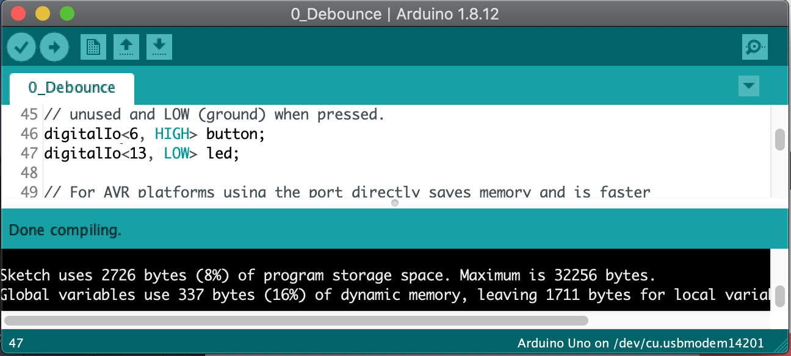
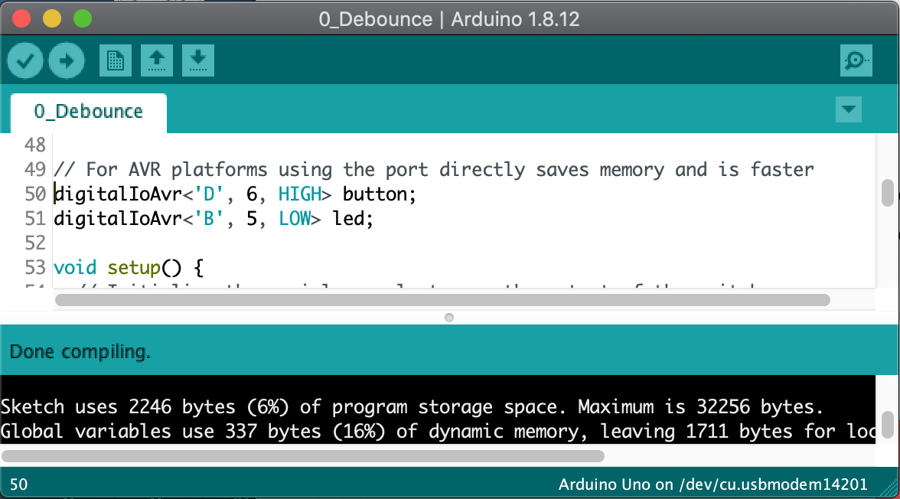
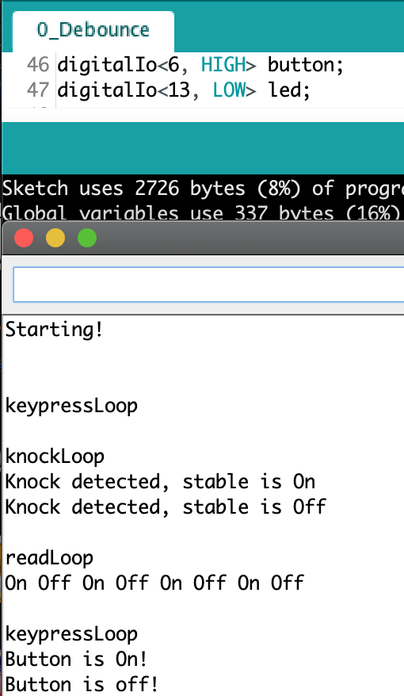
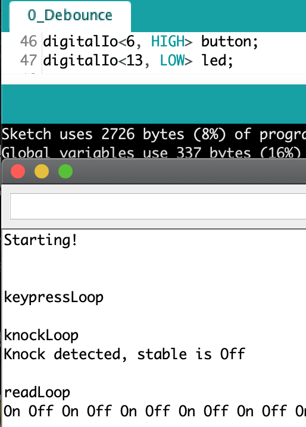

# Digital IO library
The Arduino Digital I/O  Library supports debounce of noisy sensors, detection of level changes (button press) and transient signals (knock sensors).

The library is designed to use only one byte per variable, compile very compact code, run as fast as using directly the underlying Arduino I/O functions, and provide a simple
interface with easily readable code flow (see code examples A and B below). The library also comes as an AVR specific variant that is even faster and more compact.

## Overview


This library can be used for any digital pin input signal, from sensors such as:
* ON/OFF contacts
* Transient contacts
* Push buttons and toggles
* KS0024 Bump or Knock Sensor
* KS0025 Tilt Digital Motion Sensor
* Tilt Switch
* KY-017 Mercury Switch
* A3144 Hall sensor switch
* KS0038 Reed Switch
* HC-SR501 Infrared Passive Infrared PIR Motion Sensor (on when LOW)
* Rotary Encoders
etc.

You could use native Arduino digitalRead() or digitalWrite() directly to perform I/O on digital pins but it would be messier code and would not handle debounce.
On AVR this is also realtively slow because of the way the Arduino translation layer is implemented, and __DigitalIoAvr__ provides a faster AVR version of this library that is a 1 line change in your code to use.

Using the DigitalIO library:

* Your code syntax will be more concise
* It provides compact debounce code that will filter out glitches when reading values
* It provides both transition and levels changes, to support a variety of sensors and switches, including knock sensors
* Macros can override the default debounce time to trade off resilience to noise versus faster response
* Debounce function returns immediately for the common case when there is no signal transition
* The library is coded to have near-zero code overhead without debouncing
* An AVR specific version can be used just by changing the declaration of the variables.
* Each DigitalIO variable uses only 1 byte of dynamic memory to store the value.

The debounce logic is embedded in the class, so it does not clutter your code. It is also extremely fast and efficient when no debounce is needed,
making it a good choice for programs that concurrently manage multiple things at the same time.

## Installation

Create a DigitalIo directory and copy the content of this repository into it (on Windows: MyDocuments/Arduino/libraries/DigitalIo)

Try the examples (File -> Examples -> DigitalIO).

# The library
* Classes
  * __digitalIo<pin,defaultState>__: The main class, specify the I/O pin to attach to on the board, and the default electrical level at which the sensor or output is off.
  * __digitalIoAvr<port, portBit, defaultState>__: The alternate class for AVR microcontrollers (Uno, Mega, AtTiny...), you must specify the port letter in uppercase, and the port's pin/bit.
* Configuration Methods
  * __inputMode__: The pin is an input to read, in high impedance mode, voltage will just float (no pullup resistor)
  * __inputPullupMode__: The pin is an input to read with a pull-up resistor. The rest state is usually HIGH.
  * __outputMode__: The pin is an output to write to.
* Input
  * __lastValue__: get the last value read on the port
  * __read__: read the value on the port, without processing (returns HIGH or LOW)
  * __isOff__: read the value on the port, return true if it is in the default level
  * __isOn__: read the value on the port, return true if it is not in the default level
  * __triggered__: read a debounced value on the port and return true if a transient signal was detected (any brief change of levels)
  * __changed__: read a debounced value on the port and return 1 if it changed to on, -1 if it changed to off, and 0 if there was no change
* Output
  * __write__: write a value on the port (HIGH or LOW)
  * __turnOn__: write a non-default value on the port
  * __turnOff__: write a default value on the port
* Configuration macros
  * __DIGITAL_IO_DEBUG__: turn on debugging mode (1, 2, 3, or 4)
  * __DIGITAL_IO_DEBOUNCE_DELAY__: Override how long to debounce the signal
  * __DIGITAL_IO_DEBOUNCE_LOOP_DELAY__: How long to wait between each sampling of the pin during debouncing

## Memory usage

The library comes with the classes digitalIo and digitaIoAvr. The AVR specific version doesn't use the Arduino digitalRead() or
digitalWrite() commands so it is 500B smaller, and is faster, as shown in these screenshots.





* Debounce routines require only 40 to 64B of "program storage space" memory, and return immediately unless an event to debounce is detected.
* Simple read, write and config methods are inlined and have zero overhead
* Each instance of the class uses only 1 byte of "dynamic memory" to store the last value read or written.

## 0_Debounce code example
You can load the example from the Files->Example->DigitalIO menu, compile and load it to an Arduino Uno as-is and test it with a button or any other digital sensor.
Use the Tools->Serial Monitor menu to bring up the console. It will cycle between 3 modes and show you how your sensor behaves with each mode.

Push buttons:

When using a push button or any other on/off sensor, they will change the signal level when they are enabled or detect an event. The transition from one state to another might be noisy and debounce will prevent detecting fake successive transitions. Again you can see in the raw "read" mode any noise your sensor can generate when changing state. The keypress mode will detect the keypress and key release because it will see the change in voltage level on the line. The debounce code will ignore any temporary transition and record a button event only when the level change is stable for a minimum time duration. The debounce code will ignore immediately any transition if the level goes back to the original level, instead of trying to wait for it to stabilize. If it is a valid level transition it will eventually become stable and be detected as such the next time the signal is sampled.



Knock sensors:

When using a knock sensor or similar event detection sensor, they typically will send a brief signal on the input pin that needs to be detected. It is also likely it will oscillate a lot and generate a lot of false positives if you do not debounce. The false positives can be seen in the picture in the raw "read" mode. The keypress mode does not detect any key pressed because it sees a knock as noise on the line. The Knock mode detects the brief signal and filters the associated oscillations via a debounce. The debounce only kicks in when a signal is first detected, if not the routine returns immediately. The debounce code will also make sure the line becomes stable for a minimum duration.

Note: Your loop needs to be fast enough to run through the knock detection fuction before the transitory signal disappears, else you might not detect it. This will be dependent on how you code your main loop.



## 1_Rotary_Encoder example
Rotary encoders are usefuly to change a counter. It is explained for example on [howtomechatronics](https://howtomechatronics.com/tutorials/arduino/rotary-encoder-works-use-arduino/).


The example shows on the Serial port the current rotary button value when the rotary button is pressed down.
To see the value as it is updated, comment out the debug mode.

Note that rotary encoders have their own class. This is needed because they use 3 pins, and can use interrupt handlers.

## Example A: Button

The following example shows how to use the library with a push button for which the state is either pressed or released.
In between states (transitions) are not detected but stable level changes are.

The debounce logic will detect an event only if there is a stable line level change (for example HIGH to LOW), and will
filter out any glitch or brief transitions to a different state, and discount it as noise.

```cpp
#include <DigitalIo.h>

// LED is at rest when low, and shines when high
digitalIo<13, LOW> led;
// Switch is at rest when high, and grounds the input pin to low when it is pressed
digitalIo<6, HIGH>  pushButton;

void setup() {
  // Set led as output (default is input)
  led.outputMode();
}

void loop() {
  switch (pushButton.debounce())
  {
    case 1:
      // Turn on LED when button is pressed
      led.set();
      break;
    case -1:
      // Turn off LED when button is released
      led.unSet();
      break;
    case 0:
      // Do nothing if button doesn't change
  }
  delay(50);
}
```

## Example B: Knock sensor

The following example shows how to use the library with a knock sensor. When it is activated it only sends a brief pulse.
This detects a dirac pulse (brief transition) and reports it. It does not report stable level changes.

The debounce logic will detect any brief transition on the line, regardless of if it changes the stable line level.
It will however filter out oscillations in the transition and wait for the signal to be stable on the pin.

```cpp
#include <DigitalIo.h>

// Switch is at rest when high, and grounds the pin to lowwhen pressed
digitalIo<13, HIGH> led;
digitalIo<6, HIGH>  knockSensor;

void setup() {
  led.outputMode();
}

void loop() {
  if (knockSensor.triggered())
  {
    // Toggle the LED when a knock is detected
    led.write(! led.read());
  }
  delay(50);
}
```


## Contributing

1. Fork it!
2. Create your feature branch: `git checkout -b my-new-feature`
3. Commit your changes: `git commit -am 'Add some feature'`
4. Push to the branch: `git push origin my-new-feature`
5. Submit a pull request

## History

1. Version 1.0 (DigitalSwitch - alpha version)
2. Version 2.0 (DigitalIO - Debounce transient signals, handle output,AVR version)

## Credits

Copyright (c) 2015-2019, Dan Truong

## MIT License

See the LICENCE file.
